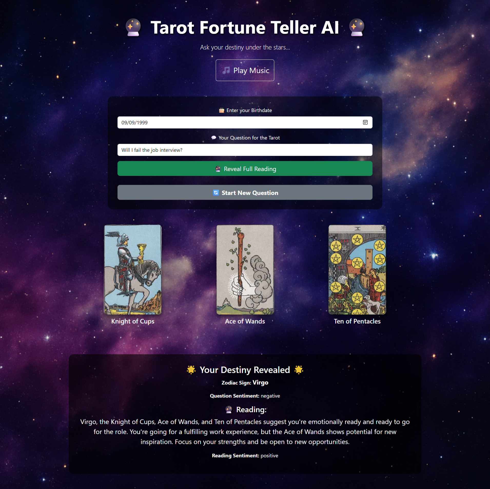

# AI-Powered Tarot Reading Using NLP and Sentiment Analysis

Team Members:
Soe Htet Naing (st125166)
Min Marn Ko (st125437)
Phue Pwint Thwe (st124784)

## Table of Contents
1. [Introduction](#introduction)
2. [Problem Statement](#problem-statement)
3. [Motivation](#motivation)
4. [Solution Requirements](#solution-requirements)
5. [Related Work](#related-work)
6. [Methodology](#methodology)
   - [Model Architecture](#model-architecture)
   - [Dataset Preparation](#dataset-preparation)
   - [Data Preprocessing](#data-preprocessing)
   - [Model Training](#model-training)
7. [Evaluation](#evaluation)
   - [Quantitative Evaluation](#quantitative-evaluation)
   - [Qualitative Evaluation](#qualitative-evaluation)
8. [Model Deployment](#model-deployment)
9. [Future Work](#future-work)
10. [Conclusion](#conclusion)

---

## 1. Introduction

This project presents an **AI-powered Tarot reading system** that utilizes **Natural Language Processing (NLP)** and **sentiment-aware AI models** to generate personalized and emotionally resonant Tarot readings. The system processes user input (birth date and question), derives the user's **zodiac sign**, detects the **sentiment** of their question using **DistilBERT**, and draws three Tarot cards. A personalized reading is generated using **Flan-T5**, a sequence-to-sequence model fine-tuned for instruction-based tasks.

By combining traditional Tarot practices with modern AI, the system aims to offer dynamic, engaging, and personalized experiences for users, enhancing accessibility to Tarot readings.

## 2. Problem Statement

Traditional Tarot reading is often **static** and **non-adaptive**, relying on intuition and predefined templates. These methods can result in generic readings that fail to address individual user needs. Existing AI Tarot systems mostly use **predefined templates**, which do not integrate **sentiment analysis** or **personalized data** (such as **zodiac signs**), making the readings feel impersonal.

This project solves these issues by incorporating **sentiment analysis** to capture emotional tones and **astrological personalization** based on users' zodiac signs, ensuring the generated readings are emotionally relevant, personalized, and dynamic.

## 3. Motivation

The motivation behind this project is to bring personalization and emotional depth to **AI-driven Tarot readings**. Key motivations include:
- **Personalized Experiences**: Leveraging **sentiment analysis** and **zodiac signs** to tailor readings to the user’s emotional state and personal background.
- **Enhanced Accessibility**: Making Tarot readings more accessible to users worldwide, offering an interactive platform to engage with the system.
- **Fusing Tradition with Technology**: Retaining the symbolic richness of traditional Tarot while enhancing it with modern AI capabilities to offer a more meaningful and engaging experience.

## 4. Solution Requirements

The AI-powered Tarot reading system should meet the following requirements to be effective:
- **Personalization**: Dynamically adapting to user inputs such as birthdate, question sentiment, and emotional context.
- **Engagement**: Providing emotionally resonant, contextually relevant, and entertaining readings.
- **Authenticity**: Integrating **astrological insights** and **numerology** to create authentic Tarot readings.
- **Ethical AI**: Ensuring the AI-generated content is **constructive**, avoiding misleading or overly deterministic predictions.

## 5. Related Work

- **Sentiment Analysis in AI-generated Content**: Studies have shown how **sentiment analysis** enhances personalization in AI content, helping to match the emotional tone of the output with the user’s emotional state.
  
- **AI in Tarot and Fortune-Telling**: Existing AI models for **predictive analytics** and **fortune-telling** have not yet fully integrated **personalization** and **zodiac-based insights**, presenting a unique opportunity for this project.

- **Text Generation Models**: **Flan-T5** and other **GPT-like models** have demonstrated strong capabilities in **text generation**, but their application in **personalized fortune-telling** is still underexplored.

## 6. Methodology

### Model Architecture

The system utilizes a **dual-model architecture**:
1. **Sentiment Classification (DistilBERT)**: This model classifies the sentiment of user input (positive, neutral, negative).
2. **Text Generation (Flan-T5)**: Based on the sentiment and **zodiac sign**, Flan-T5 generates a personalized Tarot reading.

The workflow involves:
- User input: **birthdate** and **question**.
- **Preprocessing**: Tokenization and **sentiment analysis**.
- **Sentiment Detection**: Using **DistilBERT** to classify sentiment.
- **Tarot Generation**: Using **Flan-T5** to create a reading based on the input and sentiment.

### Dataset Preparation

The dataset used for model training includes:
- **Sentiment Question Dataset**: A dataset containing **10,793** user questions labeled with sentiment (positive, neutral, negative).
- **Sentiment Reading Dataset**: **12,148** labeled Tarot readings with sentiment annotations.
- **Tarot Dataset**: Hugging Face’s dataset of **5,000+** Tarot card meanings and interpretations.
- **Synthetic Extended Dataset**: **11,990** synthetic entries with **zodiac signs**, **user questions**, **sentiment labels**, and **Tarot card draws** created using the **Gemini API**.

This dataset helps fine-tune the models for **personalized**, **emotionally resonant** Tarot readings. It includes data across six life areas: **love**, **career**, **health**, **family**, **education**, and **money**.

### Data Preprocessing

The data preprocessing steps include:
- **Input-Target Construction**: Combining the **zodiac sign**, **sentiment label**, **user question**, and **Tarot card draw** into a single input sequence. The target is the **Tarot reading**.
- **Data Cleaning**: Removing rows with missing values.
- **Tokenization**: Using **T5Tokenizer** to tokenize inputs and outputs for compatibility with **Flan-T5**.
- **Batch Mapping**: Tokenizing the dataset in batches for efficient training.

### Model Training

Both **DistilBERT** models (for question and reading sentiment) were trained using the **Hugging Face Trainer API**, with a **batch size of 16** for training and **64** for evaluation. The models were trained for **4 epochs** with a **learning rate of 2e-5** and **weight decay of 0.01**. 

The **Flan-T5 model** for text generation was fine-tuned with a **learning rate of 3e-4** over **5 epochs**, using a **batch size of 4**.

## 7. Evaluation

### Quantitative Evaluation
- **ROUGE-1**: 0.46
- **ROUGE-2**: 0.24
- **BERTScore F1**: 0.91

These metrics indicate that the model effectively captures the core themes of Tarot readings while maintaining flexibility in language generation. The **F1-score** and **accuracy** metrics for both **question** and **reading sentiment models** were **97.13%** and **97.41%**, respectively, demonstrating excellent performance.

### Qualitative Evaluation
User feedback was collected through **surveys** on:
- **Realism**: 3.2/5
- **Emotional Resonance**: 3.7/5
- **Personalization**: 3.1/5
- **Overall Satisfaction**: 3.8/5

Suggestions for improvement included the desire for **longer, more detailed readings**, especially for **emotionally complex** or **ambiguous questions**.

## 8. Model Deployment

The AI-powered Tarot reading system was deployed locally via a **Flask-based web application**, providing a seamless, interactive experience for users. The system allows users to input their **birthdate** and **question** and generates a **personalized Tarot reading** based on their input. The app uses **sentiment analysis** and **zodiac sign-based personalization** to ensure the generated readings are contextually relevant and emotionally resonant.

### Key Features of the Web Application:
- **User Input Fields**:
  - **Birthdate Input**: Users can enter their exact birthdate in **mm/dd/yyyy** format to derive their **zodiac sign**.
  - **Question Input**: A text field where users can type their Tarot-related query, such as "What is my love life like?" or "What does my career path hold?"
  
- **"Draw a Card" Button**: This button triggers the Tarot reading process, drawing three cards randomly and generating a detailed personalized reading based on the user’s zodiac sign, emotional sentiment, and drawn cards.

- **Generated Tarot Reading**: Once the user submits their information, the system generates and displays the Tarot reading in real-time, complete with the **zodiac sign** and a **sentiment-adjusted interpretation** of the three drawn cards.

- **Interactive Features**:
  - **Background Music**: An embedded **music player** button is included to enhance the immersive experience during the Tarot reading.
  - **Card Visualization**: The drawn Tarot cards are shown as images on the page, visually representing the user's Tarot session.
  - **Reading Summary**: The system provides a summary of each drawn card’s meaning in the reading.

### Deployment Process:
1. **Flask Setup**: The Flask web application was deployed on the local server, ensuring privacy and fast interactions. Users can access the application by visiting `http://127.0.0.1:5000/` in their browser.

2. **Web Interface**: The front-end interface was designed using **HTML** and **CSS** to ensure a user-friendly and visually appealing experience. **JavaScript** was used for handling button interactions and ensuring smooth communication between the front-end and back-end.

3. **Model Integration**: Both the **DistilBERT** and **Flan-T5** models were integrated into the Flask application, allowing for real-time processing of user input. The **DistilBERT model** classifies the sentiment of the question, and **Flan-T5** generates the Tarot reading based on the user's input and sentiment.

4. **Local Hosting**: The application is hosted locally, meaning that all processing and data handling occur on the user’s device, ensuring quick interactions without the need for external hosting.

### Sample Web Interface:
Here is a **screenshot** of the user interface where users can interact with the system:

The layout includes:
- **Input fields** for entering the birthdate and question.
- **Draw a Card** button that triggers the Tarot reading process.
- **Displayed Tarot reading** with visual card representations.
- **Interactive music** and user interface elements for enhanced experience.

The deployment successfully creates an engaging and immersive **Tarot reading experience**, making use of **AI-powered personalization** to tailor each reading to the user’s emotional and astrological context.

## 9. Future Work

- **Zero-Shot Testing**: To assess how well the model handles **unseen queries** and generalizes to new scenarios.
- **Retrieval-Augmented Generation (RAG)**: Incorporating **RAG** for richer, contextually relevant content by retrieving external knowledge.
- **Multi-turn Dialogue**: Implementing dynamic interactions, enabling follow-up questions and responses over multiple sessions.
- **LangChain Integration**: Adding **LangChain** for **multi-turn conversations** and better **external data integration**, further improving personalization and context.

## 10. Conclusion

This AI-powered Tarot reading system combines **sentiment analysis** and **zodiac-based personalization** to generate emotionally aligned and contextually relevant Tarot readings. With strong evaluation results, the system showcases the potential of **NLP** in enhancing traditional practices. Future work will focus on improving generalization, adding richer external knowledge, and implementing dynamic user interactions for a more engaging Tarot experience.

